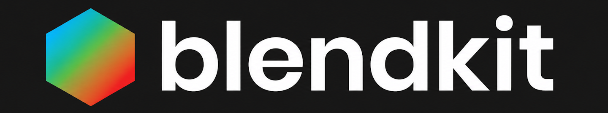

  

 

# DRH Add-ons Hub

Blender add-ons, workflow tools, and public support hubs by **DRH**.

**Author:** Paco Salas | DRH

This repository is the central index for current and upcoming DRH add-ons, with direct access to each product's public support repository and official marketplace links when available.

 

---

## About

**DRH Add-ons Hub** is the central place to explore my Blender add-ons across procedural workflows, utility tools, technical helpers, and production-focused systems.

Each add-on below includes:

- a short professional overview
- current status
- official marketplace access when available
- a direct link to its support repository

---

## Status legend

- 🟢 **Released** — approved, published, and available in the marketplace.
- 🟠 **Production Ready, Pending Approval** — ready for marketplace review or release preparation.
- 🟣 **In Development** — actively being developed and open for feedback.

---

## Availability

DRH add-ons may be released through different marketplaces and storefronts over time.

For the latest support, manuals, changelogs, compatibility reports, and issue tracking, use the linked GitHub support repositories as the primary public reference point for each add-on.

---

## Add-ons

### DRH - Color Ramp Studio

A Color Ramp workflow toolkit for Blender. **DRH - Color Ramp Studio** helps users generate, sample, convert, refine, restore, and reuse Color Ramp setups for shader, material, Geometry Nodes, and compositing workflows.

- **Status:** 🟢 Released
- **Get it on Blendkit:** [DRH - Color Ramp Studio](https://blendkit.com/addons/45ca1690-0ca4-4265-8a35-8b0d69f5dbb6/)
- **Support:** [Open support repository](https://github.com/pacosalasv/DRH_Color_Ramp_Studio-Support)

---

### DRH - Add-ons Audit

A production-focused auditing and maintenance toolkit for Blender add-ons. **DRH - Add-ons Audit** is built for users who need better visibility across installations, safer maintenance workflows, conflict review, snapshot comparison, and export-ready reporting for troubleshooting and pipeline oversight.

- **Status:** 🟢 Released
- **Get it on Blendkit:** [DRH - Add-ons Audit](https://blendkit.com/addons/4436e85f-073d-4eb2-8271-d58648303a3f/)
- **Support:** [Open support repository](https://github.com/pacosalasv/DRH_Addons_Audit-Support)

---

### DRH - Dual Units

A practical measurement and unit workflow tool for Blender. **DRH - Dual Units** is designed for users who need faster unit switching, clearer dimension feedback, dual-unit measurement context, and better scale awareness while modeling, laying out scenes, creating product visualizations, preparing technical setups, or working on scale-sensitive production assets.

- **Status:** 🟢 Released
- **Get it on Blendkit:** [DRH - Dual Units](https://blendkit.com/asset-gallery-detail/4c29e51b-2fc4-4b44-86f4-20139299b434/)
- **Support:** [Open support repository](https://github.com/pacosalasv/DRH_Dual_Units-Support)

---

### DRH - Asset Pipeline Studio

A professional multi-format asset pipeline add-on for Blender focused on importing, exporting, validating, inspecting, reporting, and batch-processing 3D assets across studio, game, CAD, marketplace, web, and 3D print workflows. **DRH - Asset Pipeline Studio** is built for cleaner handoff workflows, format interoperability, asset checking, local validation reports, and repeatable production-oriented file exchange.

- **Status:** 🟣 In Development
- **Support:** [Open support repository](https://github.com/pacosalasv/DRH_Asset_Pipeline_Studio-Support)

---

### DRH - Mechanical Component Builder

A mechanical hardware component toolkit for Blender. **DRH - Mechanical Component Builder** helps artists generate reusable hard-surface components such as fasteners, screws, nuts, washers, and springs, with cutter and assembly workflows for faster asset creation, scene detailing, and production-ready mechanical hardware setups.

- **Status:** 🟣 In Development
- **Support:** [Open support repository](https://github.com/pacosalasv/DRH_Mechanical_Component_Builder-Support)

---

### DRH - Rock Studio

A procedural rock creation toolkit for Blender. **DRH - Rock Studio** helps users generate procedural rock assets as Mesh objects or Geometry Nodes setups, with predefined 2D and 3D placement arrangements for faster environment and asset workflows.

- **Status:** 🟣 In Development
- **Support:** [Open support repository](https://github.com/pacosalasv/DRH_Rock_Studio-Support)

---

### DRH - Dice Studio

A dice generation toolkit for Blender. **DRH - Dice Studio** helps users create customizable dice meshes with labels, bevels, materials, and tabletop-ready variations for RPG, board game, render, prototype, and custom dice workflows.

- **Status:** 🟣 In Development
- **Support:** [Open support repository](https://github.com/pacosalasv/DRH_dice_studio-Support)

---

### DRH - Clock Studio

A clock generation toolkit for Blender. **DRH - Clock Studio** helps users create customizable clock meshes with faces, hands, markers, bezels, materials, and scene-ready variations for interiors, product visualization, game props, animation, architectural renders, and stylized environments.

- **Status:** 🟣 In Development
- **Support:** [Open support repository](https://github.com/pacosalasv/DRH_Clock_Studio-Support)

---

<H2><strong>Future Add-ons / Planned Development</strong></H2>

Additional DRH add-ons and concepts currently planned or being expanded as part of the DRH ecosystem.

- **DRH - Node Toolkit**  
  Faster node cleanup, layout, resizing, reroute removal, color control, and material graph organization.

- **DRH - Object Layout**  
  Alignment, distribution, spacing, transform matching, and layout tools for cleaner scene presentation.

- **DRH - Smart Cut**  
  Precision slicing, symmetry cuts, cutter planes, caps, and bevel-ready results for hard-surface production.

- **DRH - Material Inventory**  
  Material reports, image diagnostics, node checks, and exportable review data for production cleanup.

- **DRH - Asset Library Tools**  
  Metadata, licensing, previews, copyright tools, and library cleanup for publish-ready asset collections.

- **DRH - Cloud Studio**  
  Cinematic skies, soft volumes, and atmospheric depth for environment-driven scene building.
  
Community feedback is welcome as the DRH add-ons ecosystem continues to expand.

---

## More from DRH on Blendkit

Explore more Blender work by **Paco Salas | DRH** on Blendkit, including add-ons, shaders, materials, HDRIs, scenes, and production-ready resources.

**Blendkit profile:**  
https://blendkit.com/?query=author_id%3A205846