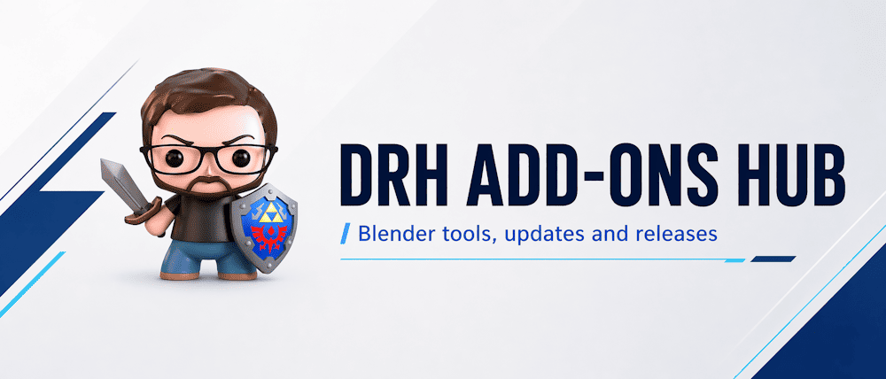

  

 

# DRH Add-ons Hub

Blender add-ons, workflow tools, and public support hubs by **DRH**.

**Author:** Paco Salas | DRH

This repository is the central index for current and upcoming DRH add-ons, with direct access to each product's public support repository.

 

---

## About

**DRH Add-ons Hub** is the central place to explore my Blender add-ons across procedural workflows, utility tools, technical helpers, and production-focused systems.

Each add-on below includes:

- a short professional overview
- current status
- a direct link to its support repository

---

## Status legend

- 🟢 **Released** — approved, published, and available in the marketplace.
- 🟠 **Production Ready, Pending Approval** — ready for marketplace review or release preparation.
- 🟣 **In Development** — actively being developed and open for feedback.

---

## Availability

DRH add-ons may be released through different marketplaces and storefronts over time.

For the latest support, manuals, changelogs, and issue tracking, use the linked GitHub support repositories as the primary public reference point for each add-on.

---

## Add-ons

### DRH - Color Ramp Studio

A Color Ramp workflow toolkit for Blender. **DRH - Color Ramp Studio** helps users generate, sample, convert, refine, restore, and reuse Color Ramp setups for shader, material, Geometry Nodes, and compositing workflows.

- **Status:** 🟢 Released
- **Support:** [Open support repository](https://github.com/pacosalasv/DRH_Color_Ramp_Studio-Support)

---

### DRH - Add-ons Audit

A production-focused auditing and maintenance toolkit for Blender add-ons. **DRH - Add-ons Audit** is built for users who need better visibility across installations, safer maintenance workflows, conflict review, snapshot comparison, and export-ready reporting for troubleshooting and pipeline oversight.

- **Status:** 🟠 Production Ready, Pending Approval
- **Support:** [Open support repository](https://github.com/pacosalasv/DRH_Addons_Audit-Support)

---

### DRH - Rock Studio

A procedural rock creation toolkit for Blender. **DRH - Rock Studio** helps users generate procedural rock assets as Mesh objects or Geometry Nodes setups, with predefined 2D and 3D placement arrangements for faster environment and asset workflows.

- **Status:** 🟣 In Development
- **Support:** [Open support repository](https://github.com/pacosalasv/DRH_Rock_Studio-Support)

---

### DRH - Asset Exchange Studio

A multi-format asset pipeline tool for Blender focused on import, export, validation, and batch-oriented asset handling. **DRH - Asset Exchange Studio** is built for cleaner handoff workflows, format interoperability, asset checking, and more reliable local exchange across production environments.

- **Status:** 🟣 In Development
- **Support:** [Open support repository](https://github.com/pacosalasv/DRH_Asset_Exchange_Studio-Support)

---

### DRH - Dice Studio

A dice generation toolkit for Blender. **DRH - Dice Studio** helps users create customizable dice meshes with labels, bevels, materials, and tabletop-ready variations for RPG, board game, render, prototype, and custom dice workflows.

- **Status:** 🟣 In Development
- **Support:** [Open support repository](https://github.com/pacosalasv/DRH_dice_studio-Support)

---

### DRH - Dual Units

A practical measurement and unit workflow tool for Blender. **DRH - Dual Units** is built for users who need faster unit switching, dual measurement context, clearer dimension feedback, and better scale awareness during modeling, layout, product visualization, technical setup, or scale-sensitive production work.

- **Status:** 🟣 In Development
- **Support:** [Open support repository](https://github.com/pacosalasv/DRH_Dual_Units-Support)

---

<H2><strong>Future Add-ons / Planned Development</strong></H2>

Additional DRH add-ons and concepts currently planned for future development.

- **DRH - Cloud Studio**  
  Cinematic skies, soft volumes, and atmospheric depth for environment-driven scene building.

- **DRH - Wheel Studio**  
  Tire, rim, tread, and wheel variation workflows built for visual control and reusable vehicle assets.

- **DRH - Smart Cut**  
  Precision slicing, symmetry cuts, cutter planes, caps, and bevel-ready results for hard-surface production.

- **DRH - Node Toolkit**  
  Faster node cleanup, layout, resizing, reroute removal, color control, and material graph organization.

- **DRH - Object Layout**  
  Alignment, distribution, spacing, transform matching, and layout tools for cleaner scene presentation.

- **DRH - Asset Library Tools**  
  Metadata, licensing, previews, copyright tools, and library cleanup for publish-ready asset collections.

- **DRH - Gear Studio**  
  Procedural gear creation with mechanical rhythm, clean variation, and precision-focused control.

- **DRH - Fastener Studio**  
  Bolts, nuts, threads, and industrial details shaped for mechanical assets and hard-surface workflows.

- **DRH - Coil Studio**  
  Springs, coils, curves, and tension-based forms for technical assets and mechanical detailing.

- **DRH - Material Inventory**  
  Material reports, image diagnostics, node checks, and exportable review data for production cleanup.

Community feedback is welcome as the DRH add-ons ecosystem continues to expand.

---

## More from DRH on BlenderKit

Explore more Blender work by **Paco Salas | DRH** on BlenderKit, including shaders, materials, HDRIs, scenes, and production-ready resources.

**BlenderKit profile:**  
https://www.blenderkit.com/?query=author_id%3A205846
